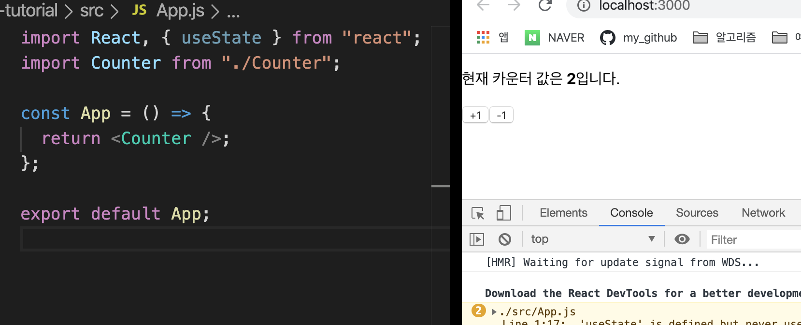
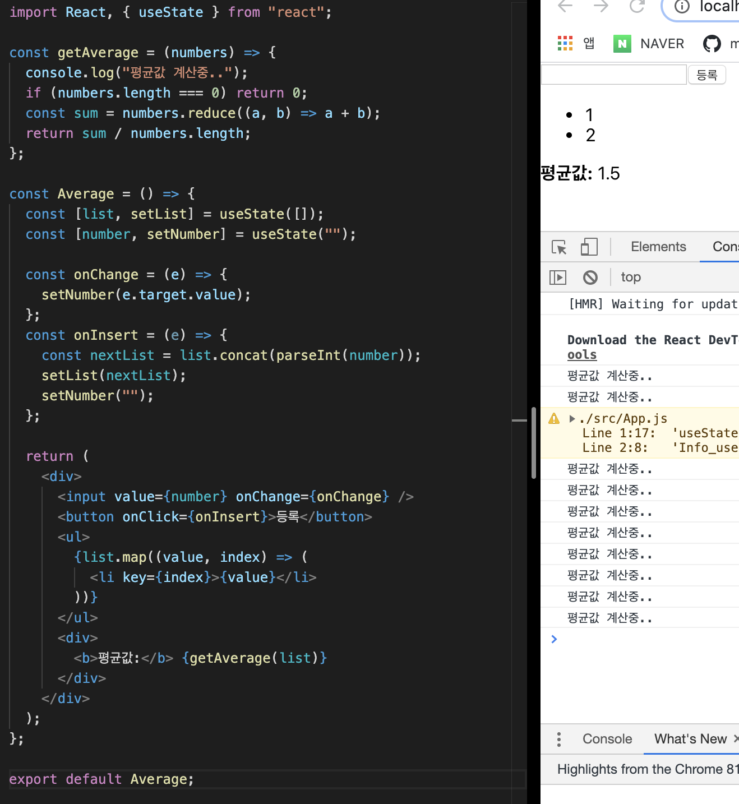
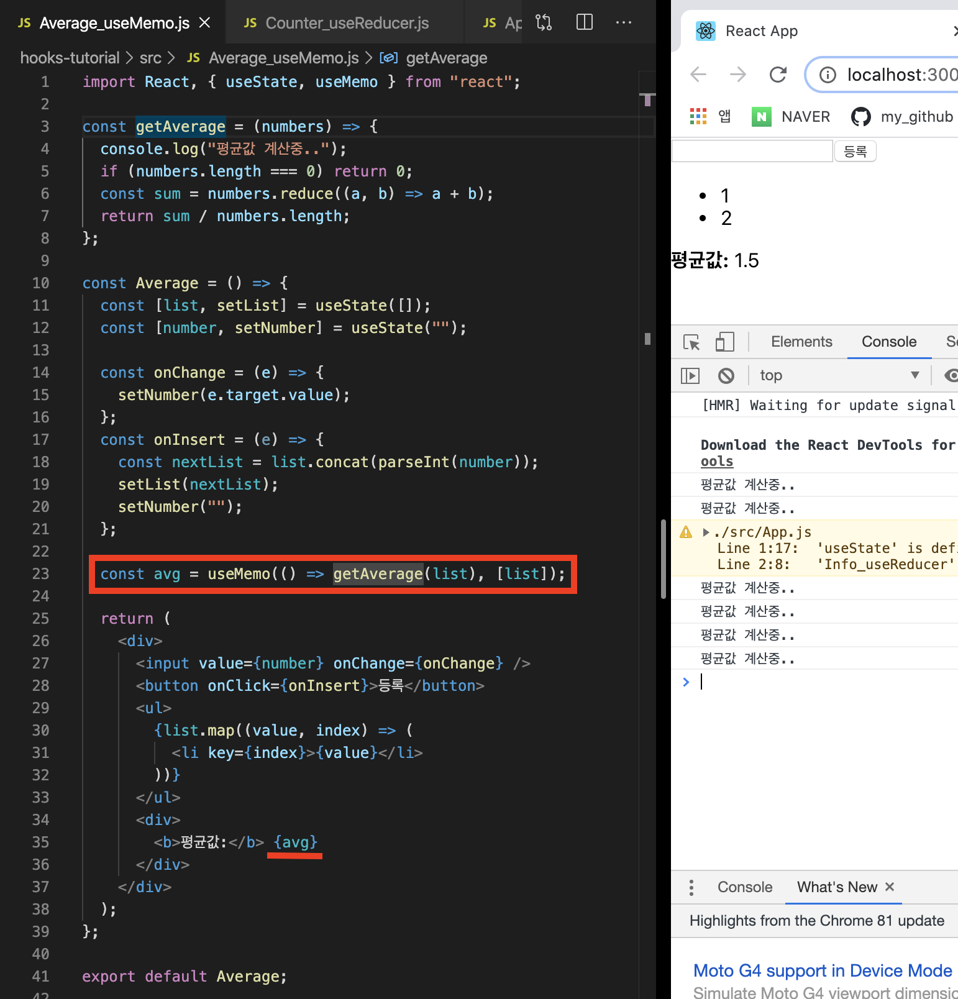
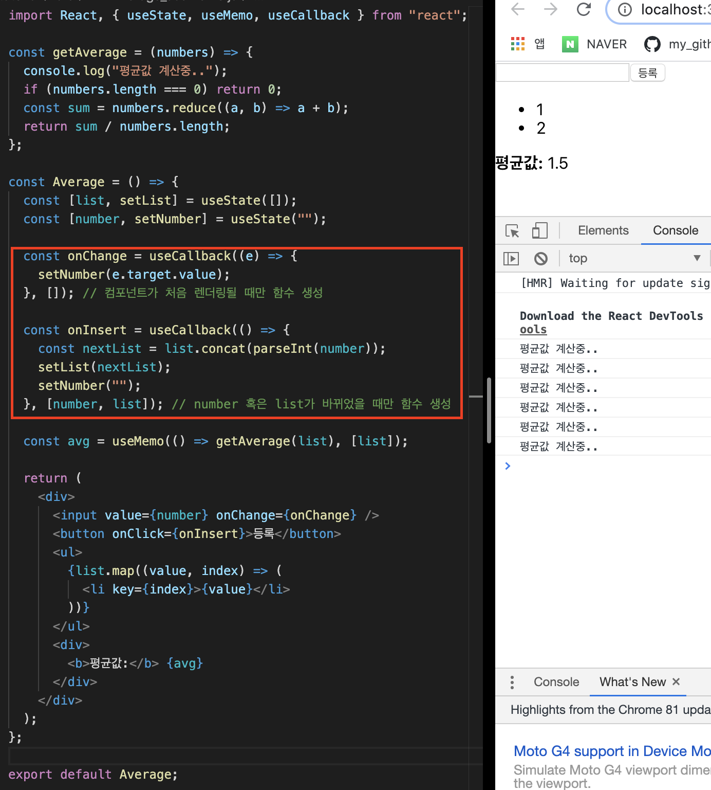
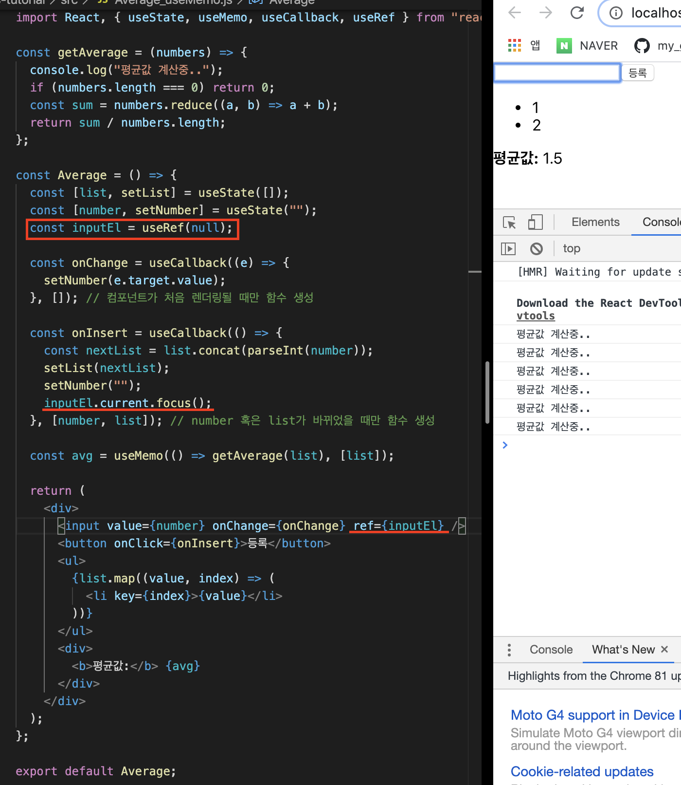
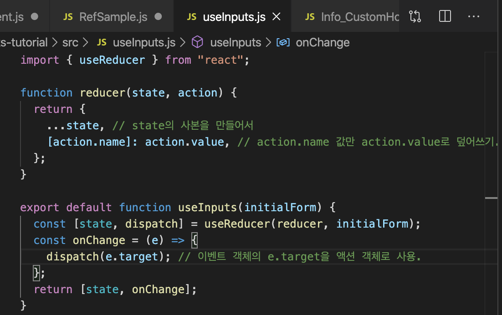
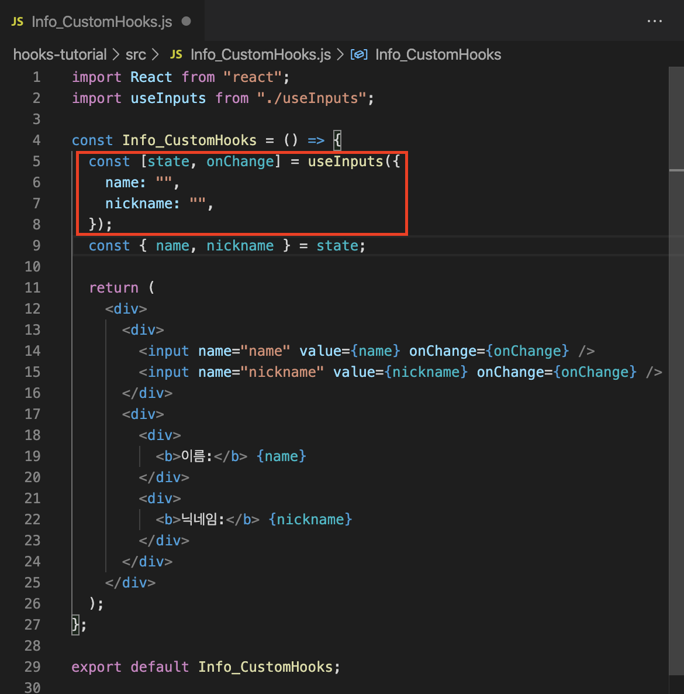

# 8장 Hooks

> Hooks는 리액트 v16.8에 새로 도입된 기능으로 함수형 컴포넌트에서도 상태관리를 할 수 있는 여러 기능을 제공한다.


## 8.1 useState

> 가장 기본적인 Hook, 함수형 컴포넌트에서도 가변적인 상태를 지닐 수 있게 해준다.
>
> > **3.4.1 함수형 컴포넌트에서 useState 사용하기** 에서 공부했으므로 간단히!

```javascript
	const [value, setValue] = useState(0);
```

useState 함수의 파라미터에는 기본값을 넣어 준다. 
반환하는 배열의 <u>첫 번째 원소는 상태 값</u>, <u>두 번째 원소는 상태를 설정하는 함수(세터 함수)</u>.
세터함수가 호출되면 전달받은 파라미터로 값이 바뀌고 컴포넌트가 정상적으로 리렌더링 된다.

관리해야 할 상태가 여러 개라면, **useState를 여러번** 사용하면 된다.

```javascript
import React, { useState } from "react";

const Info = () => {
  const [name, setName] = useState("");
  const [nickname, setNickname] = useState("");

  const onChangeName = (e) => {
    setName(e.target.value);
  };

  const onChangeNickname = (e) => {
    setNickname(e.target.value);
  };

  return (
    <div>
      <div>
        <input value={name} onChange={onChangeName} />
        <input value={nickname} onChange={onChangeNickname} />
      </div>
      <div>
        <div>
          <b>이름:</b> {name}
        </div>
        <div>
          <b>닉네임:</b> {nickname}
        </div>
      </div>
    </div>
  );
};

export default Info;
```

결과

 


---


## 8.2 useEffect

> 리액트 컴포넌트가 랜더링될 때마다 특정 작업을 수행하도록 설정할 수 있는 Hook.
>
> 클래스형 컴포넌트의 componentDidMount 와 componentDidUpdate를 합친 형태로 볼 수 있음.


**위에서 만든 Info 컴포넌트에 useEffect() 를 적용했다.**
state 값이 바뀔 때 마다 컴포넌트가 리랜더링 되어 useEffect가 실행된다.


### > 마운트될 때만 실행

useEffect 에서 설정한 함수를 컴포넌트가 화면에 맨 처음 렌더링괼 때만 실행하고, 업데이트될 때는 실행하지 않으려면, 
<u>함수의 두 번째 파라미터로 비어 있는 배열</u>을 넣어 주면 된다.

```javascript
  useEffect(() => {
    console.log("마운트될 때만 실행됩니다.");
  }, []);
```

 (콘솔창을 보면, 처음 마운트될 때만 실행되고, 업데이트될 때는 실행하지 않음.)

 


### > 특정 값이 업데이트될 때만 실행

클래스형 컴포넌트에서는 componentDidUpdate 라이프사이클 메서드를 사용하여 아래처럼, props의 value값이 바뀔 때만 특정 작업을 수행 할 수 있다.

```javascript
componentDidUpdate(prevProps, prevState) {
    if (preProps.value !== this.props.value) {
      doSomething();
    }
  }
```

이런 작업을 **useEffect**에서 하려면,  useEffect의 <u>두 번째 파라미터로 전달되는 배열 안에 검사하고 싶은 값을 넣어 주면</u> 된다.

```javascript
useEffect(() => {
	console.log(name);
}, [name]);
```

(name값이 바뀔 때만 실행) 

 


### > 뒷정리 함수 (cleanup) 

컴포넌트가 언마운트되기 전이나 업데이트되기 직전에 어떠한 작업을 수행하고 싶다면 useEffect에서 뒷정리(cleanup) 함수를 반환해 주어야 한다.

```javascript
useEffect(() => {
  console.log('effect');
  console.log(name);
  return () => {
    console.log('cleanup');
    console.log(name);
  };
});
```

App 컴포넌트에서 Info 컴포넌트의 가시성을 바꿀 수 있게 수정.
(컴포넌트가 나타날 때 콘솔에 effect가 찍히고, 사라질 때 cleanup이 찍힌다.)


 인풋을 수정하면, 리렌더링 될 때마다 뒷정리 함수가 계속 나타난다.
 뒷정리 함수가 호출될 때는 업데이트 되기 직전의 값을 보여준다.

 


**>> 뒷정리 함수도 useEffect 함수의 두번째 파라미터에  따라, 빈 배열을 넣으면 오직 언마운트 될 때만 호출하고, 배열안에 특정 값을 넣으면 특정 값이 업데이트 될 때만 호출된다!**


---


## 8.3 useReducer

> useReducer는 useState보다 더 다양한 컴포넌트 상황에 따라 다양한 상태를 다른 값으로 업데이트해 주고 싶을 때 사용하는 Hook 이다.
>
> > 리듀서는 **현재상태**, 그리고 업데이트를 위해 필요한 정보를 담은 **액션(action)값**을 전달받아 새로운 상태를 반환하는 함수다.  리듀서 함수에서 새로운 상태를 만들 때는 반드시 **불변성**을 지켜야 한다.
> >
> > ```javascript
> > function reducer(state, action) {
> >   return {...}; // 불변성을 지키면서 업데이트한 새로운 상태를 반환한다.
> > }
> > ```
> >
> > 액션 값은 주로 다음과 같은 형태로 이루어져 있다.
> >
> > ```javascript
> > {
> > 	type: 'INCREMENT',
> > 	// 다른 값들이 필요하다면 추가로 들어감
> > }
> > ```
> >
> > 17장에서 다룰 리덕스에서 사용하는 액션 객체에는 어떤 액션인지 알려주는 type필드가 필수지만, 
> >
> > useReducer에서 사용하는 액션 객체는 type이 필수가 아니며, 객체가 아니라 문자열이나 숫자여도 상관없다.


### > useReducer를 사용하여 Counter 구현
useReducer의 <u>첫 번째 파라미터에는 리듀서 함수</u>를 넣고, <u>두 번째 파라미터에는 해당 리듀서의 기본값</u>을 넣는다.
이 Hook을 사용하면 state값과 dispatch 함수를 받아오는데, <u>state는 현재 가리키고 있는 상태</u>고, <u>dispatch는 액션을 발생시키는 함수</u>다. **dispatch(action)** 형태로, **함수안에 파라미터로 액션 값을 넣어 주면 리듀서 함수가 호출되는 구조** 이다.

```javascript
import React, { useReducer } from "react";

function reducer(state, action) {
  // action.type에 따라 다른 작업 수행
  switch (action.type) {
    case "INCREMENT":
      return { value: state.value + 1 };
    case "DECREMENT":
      return { value: state.value - 1 };
    default:
      // 아무것도 해당되지 않을 때 기존 상태 반환
      return state;
  }
}

const Counter = () => {
  const [state, dispatch] = useReducer(reducer, { value: 0 });

  return (
    <div>
      <p>
        현재 카운터 값은 <b>{state.value}</b>입니다.
      </p>
      <button onClick={() => dispatch({ type: "INCREMENT" })}>+1</button>
      <button onClick={() => dispatch({ type: "DECREMENT" })}>-1</button>
    </div>
  );
};

export default Counter;
```

App에서 Counter를 렌더링 해주면, 잘 작동하는 것 확인.




useReducer의 장점은 컴포넌트 업데이트 로직을 컴포넌트 바깥으로 빼낼 수 있다는 것!


### > 인풋 상태 관리하기

기존에 input이 여러개여서 useState를 여러번 사용했는데, useReducer를 사용하면 그러지 않아도 된다.
이벤트 객체가 지니고 있는 e.target 값 자체를 액션 값으로 사용하여 , 인풋의 개수가 많아져도 코드를 짧게 유지할 수 있다.

```javascript
import React, { useReducer } from "react";
// 리듀서 함수
function reducer(state, action) {
  return {
    ...state,											// state의 사본을 만들어서
    [action.name]: action.value, 	// action.name 값만 action.value로 덮어쓰기.
  };
}

const Info_useReducer = () => {
  const [state, dispatch] = useReducer(reducer, {
    name: "",
    nickname: "",
  });
  const { name, nickname } = state;

  const onChange = (e) => {
    dispatch(e.target); // 이벤트 객체의 e.target을 액션 객체로 사용.
  };

  return (
    <div>
      <div>
        <input name="name" value={name} onChange={onChange} />
        <input name="nickname" value={nickname} onChange={onChange} />
      </div>
      <div>
        <div>
          <b>이름:</b> {name}
        </div>
        <div>
          <b>닉네임:</b> {nickname}
        </div>
      </div>
    </div>
  );
};

export default Info_useReducer;
```


---


## 8.4 useMemo

> useMemo를 사용하면 함수형 컴포넌트 내부에서 발생하는 연산을 최적화 할 수 있다.

### > useMemo 없이 평균 구하기

리스트에 숫자를 추가하면 추가된 숫자들의 평균을 보여주는 함수형 컴포넌트를 작성.



이 방식은 useState의 세터 함수가 호출될 때마다 컴포넌트가 리렌더링 되기 때문에, 숫자를 등록할 때뿐만 아니라, 인풋 내용이 수정될 때도 getAverage 함수가 호출된다. 이렇게 불필요한 연산은 낭비!!


### > useMemo를 사용하여 최적화 하기
> 렌더링 하는 과정에서 특정 값이 바뀌었을 때만 연산을 실행하고, 원하는 값이 바뀌지 않았다면 이전에 연산했던 결과를 다시 사용하는 방식이다.



list의 내용이 바뀔 때만 getAverage 함수가 호출 된다.


---


## 8.5 useCallback

> useMemo와 비슷한 함수 이며, 이 Hook을 사용하면 이벤트 핸들러 함수를 필요할 때만 생성할 수 있다.

위의 Average 컴포넌트를 useCallback을 사용하여 최적화 하자.

useCallback의 <u>첫 번째 파라미터에는 생성하고 싶은 함수</u> 를 넣고, <u>두 번째 파라미터에는 배열</u> 을 넣는다.
이 배열에는 어떤 값이 바뀌었을 때 함수를 새로 생성해야 하는지 명시해야 한다.

두 번째 파라미터에 onChange처럼 빈 배열을 넣게 되면 컴포넌트가 렌더링될 때 단 한 번만 함수가 생성되고,
onInsert처럼 number와 list를 넣게 되면 number 값이 바뀌거나 list에 새로운 항목이 추가될 때마다 함수가 생성됨.




다음 두 코드는 완전히 똑같은 코드이다. <u>useCallback은 결국 useMemo로 함수를 반환하는 상황에서 더 편하게 사용할 수 있는 Hook이다.</u>
**숫자, 문자열, 객체처럼 일반 값을 재사용하려면 useMemo를, 함수를 재사용하려면 useCallback을 사용하자!**

```javascript
useCallback(() => {
  console.log('hello world!');
}, [])
```

```javascript
useMemo(() => {
  const fn = () => {
    console.log('hello world!');
  };
  return fn;
}, [])
```


---


## 8.6 useRef

> useRef Hook은 함수형 컴포넌트에서 ref를 쉽게 사용할 수 있도록 해준다.

Average 컴포넌트에서 '등록' 버튼을 눌렀을 때 포커스가 인풋 쪽으로 넘어가도록 코드를 작성해 보자.

useRef를 사용하여 ref를 설정하면 useRef를 통해 만든 객체 안의 current 값이 실제 엘리먼트를 가리킨다.




### > 로컬 변수 사용하기

컴포넌트 로컬 변수를 사용해야 할 때도 useRef를 활용할 수 있다.
로컬 변수란, 렌더링과 상관없이 바뀔 수 있는 값을 의미한다.

**클래스형 컴포넌트**

```javascript
import React, { Component } from 'react';

class MyComponent extends Component {
    id = 1
    setId = (n) => {
        this.id=n;
    }
    printId = () => {
        console.log(this.id);
    }
    render() {
        return (
            <div>
                MyComponent
            </div>
        );
    }
}

export default MyComponent;
```

**함수형 컴포넌트**

```javascript
import React, { useRef } from 'react';

const RefSample = () => {
    const id = useRef(1);
    const setId = (n) => {
        id.current = n;
    }
    const printId = () => {
        console.log(id.current);
    }
    return (
        <div>
            refsample
        </div>
    );
};

export default RefSample;
```

<주의점>
ref 안의 값이 바뀌어도 컴포넌트가 렌더링되지 않는다는 점에는 주의해야 한다.
렌더링과 관련되지 않은 값을 관리할 때만 이러한 방식으로 코드를 작성해야 한다.


---


## 8.7 커스텀 Hooks 만들기

여러 컴포넌트에서 비슷한 기능을 공유할 경우, 이를 따로 분리하여 커스텀 Hook으로 작성하여 로직을 재사용 할 수 있다.

기존에 Info 컴포넌트에서 여러 개의 인풋을 관리하기 위해 useReducer로 작성했던 로직을 useInputs라는 Hook으로 따로 분리해 보자.

**useInputs라는 커스텀 Hook**



**useInputs Hook을 Info 컴포넌트에 사용**




---


## 8.8 다른 Hooks

커스텀 Hooks를 만들어서 사용한 것처럼, 다른 개발자가 만든 Hooks도 라이브러리로 설치하여 사용할 수 있다.

다른 개발자가 만든 다양한 Hooks 리스트는 다음 링크에서 확인할 수 있다.

* [https://nikgraf.github.io/react-hooks/](https://nikgraf.github.io/react-hooks/)
* [https://github.com/rehooks/awesome-react-hooks](https://github.com/rehooks/awesome-react-hooks)

